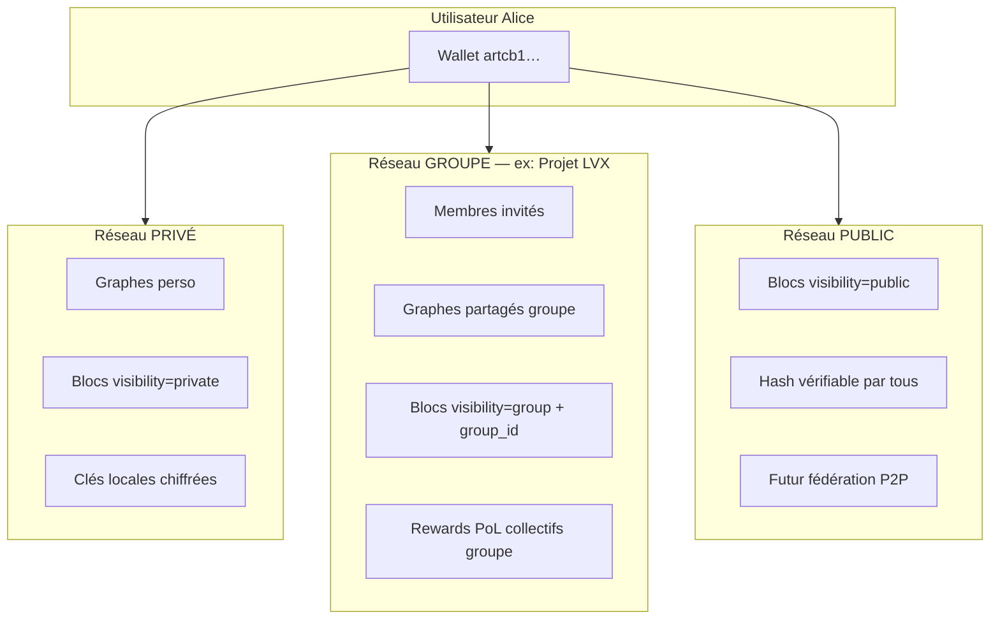
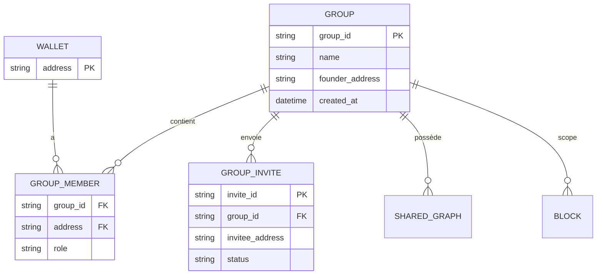
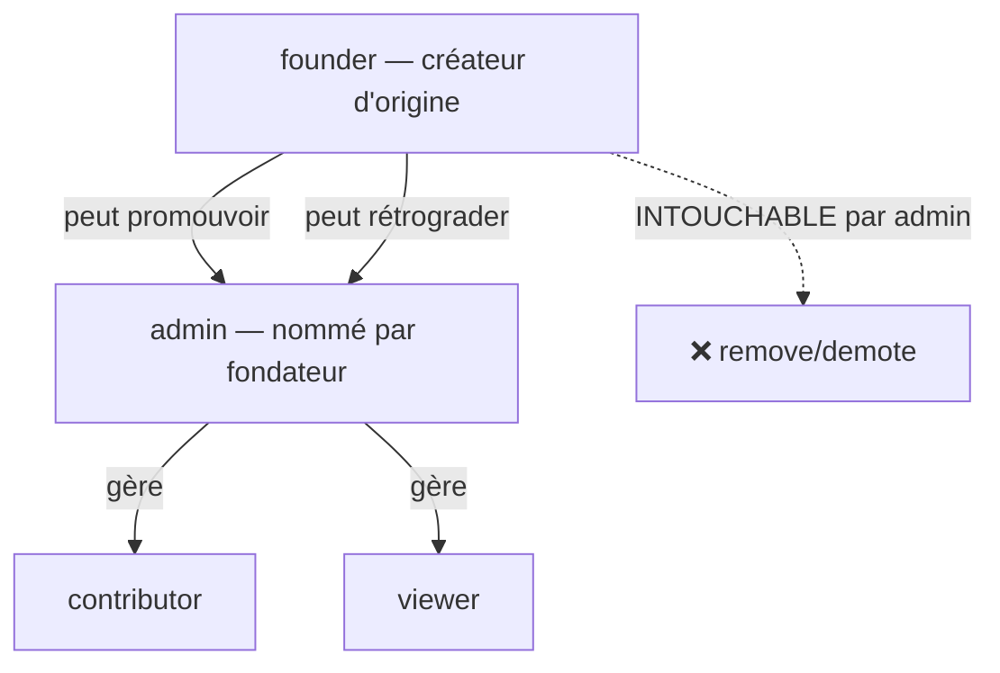
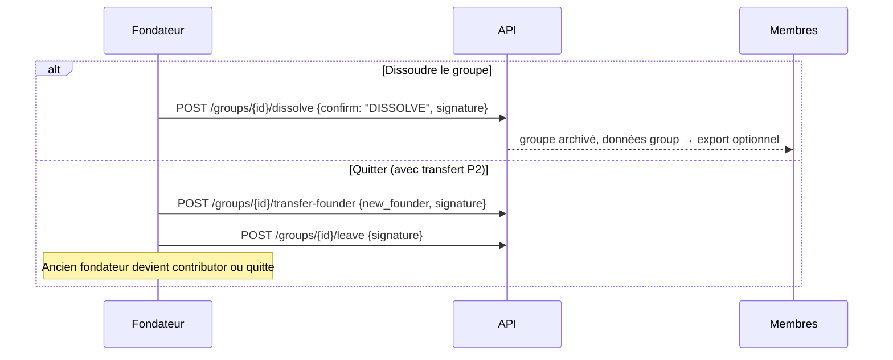
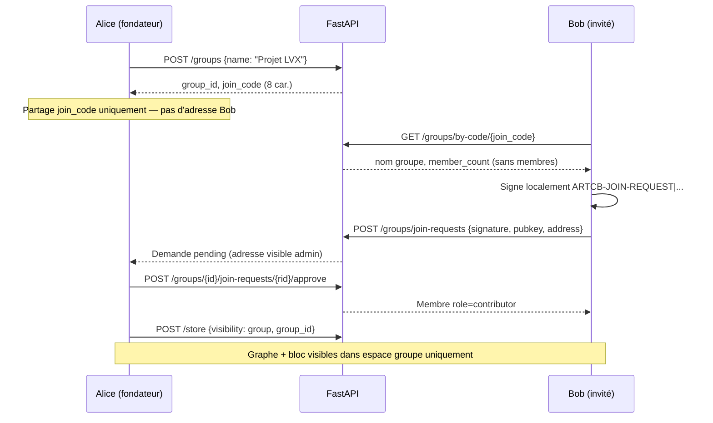

# Groupes & Réseaux ARTCB — Spécification v1.1

> **OBSOLÈTE — document historique (2026-07-07).** Les réponses « Non — pas de modèle
> groupe en backend » ci-dessous décrivaient l’état de juillet 2026. Depuis,
> `src/api/groups_routes.py` et `src/api/privacy_routes.py` existent. Ce fichier
> n’est **pas** une source de vérité (rapport 214 : « l’ancien audit est maintenant
> insuffisant »). L’audit de confidentialité réelle des groupes (filtrage `visibility`,
> chiffrement, P2P) est ouvert dans `rapports/215_*` §4. Hiérarchie des sources :
> `docs/PROTOCOL_SOURCE_OF_TRUTH.md`.

**Horodatage :** 2026-07-07T05:00:00Z  
**Statut :** **OBSOLÈTE** — conservé pour l’historique des règles fondateur/admin  
**Audit code :** `rapports/046_audit_code_total_groupes_fondateur_admin.md` (73 fichiers, ~8497 lignes)

---

## 1. Réponse directe à votre question

| Question | Réponse |
|----------|---------|
| Le CDC dashboard actuel inclut-il les groupes multi-utilisateurs ? | **Non** — jusqu’à v1.4, seulement inspiration visuelle Cursor Members / Supermemory Organization |
| Existe-t-il déjà en backend ? | **Non** — pas de modèle groupe, invitation, membership, ACL |
| Existe-t-il partiellement ? | **Oui, minimal** — champ `visibility: "private"` sur les blocs (stocké, **non filtré**) |
| Mode « Shared / groupe » documenté ? | **FAQ seulement** — `FAQ_NON_EXPERTS_ARTCB.md` mentionne Shared, **code absent** |

**Conclusion :** votre vision **Public / Privé / Groupe** doit être **ajoutée de bout en bout** (backend + API + dashboard).

---

## 2. Modèle cible — trois réseaux



| Réseau | Qui voit quoi ? | Qui peut contribuer ? | Inspiration captures |
|--------|-----------------|----------------------|----------------------|
| **Privé** | Seul le propriétaire wallet | Moi seul | Supermemory org perso |
| **Groupe** | Membres du groupe uniquement | Membres avec rôle ≥ contributor | **Cursor Teams / Supermemory Team** |
| **Public** | Tout le monde (hash + métadonnées) | Tout détenteur wallet (anti-Sybil) | Mempool public chain |

---

## 3. Ce qui existe aujourd’hui (audit code)

| Élément | Fichier | État |
|---------|---------|------|
| `visibility` sur bloc | `chain/manager.py`, `routes.py` StoreRequest | ✅ stocké (`private` défaut) |
| Filtrage par visibility | — | ❌ absent |
| `visibility: public` | CDC §3.2.5 | ⚠️ prévu, non testé UI |
| `visibility: shared` + `group_id` | — | ❌ absent |
| Comptes utilisateurs | — | ❌ absent (wallet = identité) |
| CRUD groupes | — | ❌ absent |
| Invitations | — | ❌ absent |
| ACL par graphe/bloc | — | ❌ absent |

**Identité actuelle :** adresse wallet Ed25519 (`artcb1…`) — pas de login email/mot de passe.

---

## 4. Spécification fonctionnelle — Groupes

### 4.1 Entités



### 4.2 Hiérarchie des rôles (v1.1 — fondateur protégé)



| Rôle | Lire | Mémoriser | Signer | Inviter | Retirer membres | Promouvoir admin | Dissoudre groupe |
|------|------|-----------|--------|---------|-----------------|------------------|------------------|
| **founder** | ✓ | ✓ | ✓ | ✓ | ✓ (sauf soi via règles) | ✓ **seul** | ✓ **seul** |
| **admin** | ✓ | ✓ | ✓ | ✓ | ✓ sauf **founder** | ❌ | ❌ |
| **contributor** | ✓ | ✓ | ✓ | ❌ | ❌ | ❌ | ❌ |
| **viewer** | ✓ | — | — | ❌ | ❌ | ❌ | ❌ |

**Note :** `founder` = `founder_address` fixé à la création, **jamais modifiable**.

---

### 4.6 Sécurité du créateur d'origine (INVARIANTS — PROTOCOLE)

**Expertise :** sécurité ACL + gouvernance multi-tenant.

| Règle | Détail | Code futur |
|-------|--------|------------|
| **F1** | `founder_address` immuable dès `POST /groups` | champ read-only JSON |
| **F2** | Aucun admin/membre ne peut **retirer** le fondateur | `403 FOUNDER_IMMUTABLE` |
| **F3** | Aucun admin ne peut **rétrograder** le fondateur | `403 FOUNDER_IMMUTABLE` |
| **F4** | Aucun admin ne peut **promouvoir** quelqu'un admin | seul fondateur |
| **F5** | Seul le fondateur peut **promouvoir/rétrograder** les admins | signature wallet requise |
| **F6** | Seul le fondateur peut **se retirer** lui-même | via dissolve OU leave après transfert |
| **F7** | Auto-suppression fondateur = **dissolve** groupe | double confirmation + signature |
| **F8** | Transfert fondateur (optionnel P2) | fondateur signe `POST /groups/{id}/transfer-founder` |

#### F6/F7 — Auto-suppression fondateur (flux)



**PROTOCOLE :**
- Pas de suppression silencieuse — log `logs/groups_audit.jsonl`
- Rapport `rapports/` après chaque dissolve
- Mode DEBUG : tracer toute tentative `FOUNDER_IMMUTABLE` bloquée

---

### 4.7 Gestion admin — nommer un membre admin

| Action | Qui | Endpoint proposé |
|--------|-----|------------------|
| Promouvoir `contributor` → `admin` | **Fondateur** | `POST /groups/{id}/members/{addr}/role {role: "admin"}` |
| Rétrograder `admin` → `contributor` | **Fondateur** | même endpoint `{role: "contributor"}` |
| Lister admins | Tous membres | `GET /groups/{id}` → section `admins[]` |
| Admin retire un contributor | Admin+ | `DELETE /groups/{id}/members/{addr}` + check ≠ founder |

**UI dashboard (V10.3) :** bouton « Nommer admin » visible **uniquement** pour le fondateur.

---

### 4.8 Matrice refus ACL (tests obligatoires)

| Tentative | Acteur | Résultat |
|-----------|--------|----------|
| Retirer fondateur | admin | **403** |
| Rétrograder fondateur | admin | **403** |
| Promouvoir admin | admin | **403** |
| Promouvoir admin | fondateur | **200** |
| Dissoudre groupe | admin | **403** |
| Dissoudre groupe | fondateur | **200** + audit log |
| Modifier `founder_address` | quiconque | **403** |

---

### 4.3 Flux — créer un groupe et rejoindre (Solution 2 — request-to-join)

**Sécurité :** le fondateur ne connaît **jamais** la clé privée des invités. Il partage uniquement un `join_code` public (8 caractères). L'adresse wallet de l'invité n'apparaît qu'au moment où l'invité soumet une **demande signée** (Ed25519). L'invite directe par adresse (`POST /members`) est **désactivée** en production (`ARTCB_DEBUG_DIRECT_MEMBER=false`).



### 4.4 API implémentée (dashboard-dev)

| Méthode | Endpoint | Action |
|---------|----------|--------|
| POST | `/groups` | Créer groupe (fondateur = wallet connecté) |
| GET | `/groups` | Lister mes groupes (`?address=`) |
| GET | `/groups/by-code/{join_code}` | Info publique (sans adresses membres) |
| POST | `/groups/join-requests` | Soumettre demande signée |
| POST | `/groups/join-requests/sign-with-wallet` | Devnet : signer avec wallet local serveur |
| GET | `/groups/{id}/join-requests` | Lister demandes (fondateur/admin) |
| POST | `/groups/{id}/join-requests/{rid}/approve` | Approuver adhésion |
| POST | `/groups/{id}/join-requests/{rid}/reject` | Refuser adhésion |
| GET | `/groups/{id}` | Détail + membres |
| POST | `/groups/{id}/members` | **DEBUG seulement** — invite directe désactivée |
| POST | `/groups/{id}/members/{addr}/role` | **Fondateur** : promouvoir/rétrograder admin |
| DELETE | `/groups/{id}/members/{addr}` | Retirer membre (≠ fondateur) |
| POST | `/groups/{id}/dissolve` | **Fondateur** : dissoudre (confirm `DISSOLVE`) |
| POST | `/store` | **étendu** : `visibility` = `private\|group\|public`, `group_id?` |
| GET | `/chain?group_id=` | Blocs filtrés par groupe |

### 4.5 Stockage (MVP fichier)

```
data/groups/
  g_abc123.json                    # founder_address immuable, join_code, members[]
  g_abc123_join_requests.jsonl     # demandes signées pending/approved/rejected
  groups_audit.jsonl               # dissolve, FOUNDER_IMMUTABLE, join_request_*
```

Exemple `g_abc123.json` :
```json
{
  "group_id": "g_abc123",
  "name": "Projet LVX",
  "founder_address": "artcb1q…",
  "join_code": "A1B2C3D4",
  "created_at": "2026-07-07T05:00:00Z",
  "members": [{"address": "artcb1q…", "role": "founder", "joined_at": "…"}]
}
```

Extension bloc JSONL :
```json
{
  "visibility": "group",
  "group_id": "g_abc123",
  ...
}
```

---

## 5. Dashboard — Vue V10 Groupes

Voir `DASHBOARD_WIREFRAMES_ASCII.md` § V10.

**Sélecteur contexte** (header global — style Supermemory org dropdown) :
```
[ Mon espace ▼ ]  →  Privé | Groupe: Projet LVX | Public
```

Toutes les vues V1–V8 **filtrent les données** selon le contexte réseau actif.

---

## 6. Plan d’intégration bout en bout

| Phase | Contenu | % | Gate |
|-------|---------|---|------|
| **G0** | Validation spec groupes (ce doc) | 0 % | **Vous** |
| **G1** | Modèle `GroupManager` + fichiers JSON | 15 % | Tests unitaires |
| **G2** | API `/groups/*` + auth signature wallet | 30 % | Postman / pytest |
| **G3** | `visibility` + `group_id` sur store/chain + filtrage | 50 % | Tests ACL |
| **G4** | Dashboard V10 + sélecteur réseau header | 70 % | GO dashboard |
| **G5** | Invitations UI + notifications | 85 % | Tests manuels |
| **G6** | P2P fédération public (hors MVP) | — | Phase ultérieure |

**Dépendance :** phases G1–G3 peuvent démarrer **avant** le dashboard ; G4–G5 dans le dashboard.

---

## 7. Validation attendue

```
1. Modèle 3 réseaux : OUI / NON
2. Fondateur immuable + admin nommé par fondateur : OUI / NON
3. Auto-suppression fondateur = dissolve uniquement : OUI / MODIFIER
4. Identité wallet pour MVP : OUI / NON
5. Backend G1–G3 avant dashboard : OUI / NON
6. GO implémentation groupes : OUI / NON
```

---

**Non implémenté — document de validation uniquement.**
